这是一个网络爬虫，百度贴吧的全吧下载

前言: 本人关注太阳的后裔吧很久了但是从来不发帖,直到有一天我收藏了很久了一个帖子突然消失不见了,后来才知道被百度删掉了,楼主申请恢复帖子无望~很失望很愤怒,明明是那么健康向上的帖子怎么说没就没了呢？对得起那些辛苦盖楼的吧友吗？！于是分享给大家一个全贴吧备份文件,以后什么帖子丢了还可以到这里找找, 也不会太难过。

# 2025.11.05
突然找到了原始贴吧备份文件，就把全部备份上传到pages文件夹里了。注意：解压要花很多时间。我正考虑用PowerShell + WinForms把这个项目重构一下，反正逻辑很简单，然后用ps2exe把*.ps1生成一个exe文件。

# 2016.07.03
加入模拟手机浏览器进行备份的功能,好处嘛,备份文件大大变小了,可以放到手机上看了!
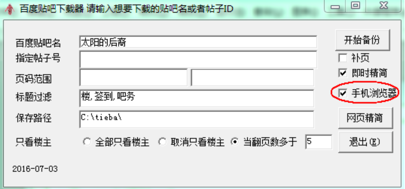
默认模拟ipad上的浏览器,你可以在ini.txt改userAgent为任何你想要的设置.功能还不完善,慎用.

# 2016.06.28  
重大更新: 翻页的时候会弹出登录框的问题完美解决!!
网页精简功能做好了.完美解决翻页问题!!今天用最新作了”军舰岛”吧的备份.
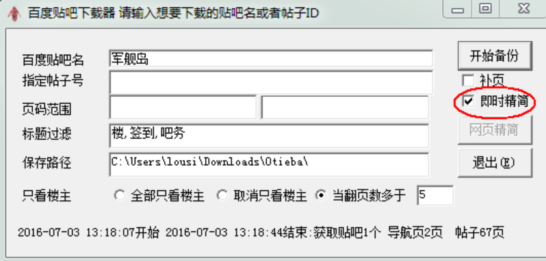
重新作了”太阳的后裔”吧的备份,比上次加了过滤和精简功能,没想到居然备份文件缩小到1.85GB 共11007个网页(其中125个是已过滤的空网页),耗时18:56~20:31仅仅1小时35分钟(上次是4个小时).这个贴吧居然有60%是水贴?!
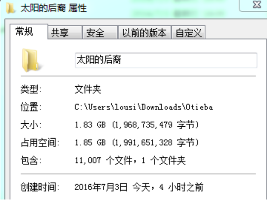
# 2016.06.25
百度贴吧-太阳的后裔吧 全吧完整备份 时间点 2016.06.25 
包含太阳的后裔吧自2014.11创建以来至2016.06.25 03:53所有帖子,帖子的回复,回复的回复.备份文件格式 htm 共27041个网页 原始大小 6.44G  使用rar最强压缩后有131M(解压前请注意硬盘剩余空间)
链接探索方式: 3层(贴吧首页及翻页-帖子-帖子翻页)
适配浏览器: 电脑版IE11,电脑版百度浏览器 (手机浏览器就不要试了 效果真的很差) 

网页已经尽我最大的可能脱水处理,将所有浮动广告和无关栏目都删掉了,留一个清爽的界面专心看帖子.

版权声明: 此备份文件版权属于所有参与发帖者.仅作艺术研究之用,请在下载后24小时内删除,否则一切后果自付.作为备份操作人员的我只能保证帖子内容未做任何增删改,绝无密码严禁转载.

已知问题:
1. 注意这是死的网页不是真的贴吧,所以所有互动的环节,比如发新帖,回复,举报,送礼物,关注作者之类都别我删掉了,万一有漏网的也千万别瞎点.
2.只看楼主,跳到第X页失效. 其实地址是pn1.htm就是第1页,pn2就是第2页,自己手工跳页吧.
3.回复的回复(所谓的楼中楼)只能看到前5个,后面的层数虽然存在于网页里但是翻页按钮失灵了所以都看不到.后继找高手研究一下吧.
4.必须有网才能看到图片, 没网的时候只能看到文字部分而且某些格式会乱掉.
5.(已解决!)我在登录贴吧的状态下作贴吧备份,所有的翻页链接都是好好的,点了就直接跳转了;后来要分享给大家,作备份的时候特意退出了我的登录帐号,结果备份作好了以后所有的翻页链接点上去会弹出一个强制登录百度的框,真的无语了~所以贴吧首页底部的那些数字请用鼠标右键点上去,选"在新标签页中打开".不要直接点,会没反应或者报错!
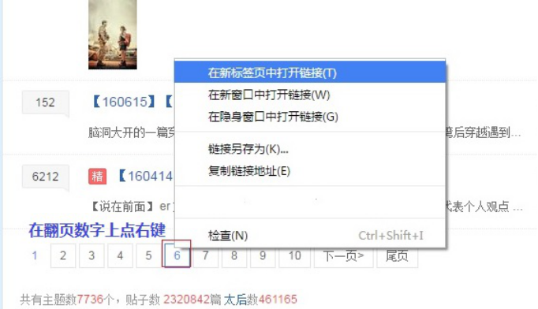
6.贴吧首页说这个吧有帖子232万个,这个数字 = 所有的主题帖(顶楼)+回复(所谓的地板,沙发之类的)+回复的回复(所谓的楼中楼) - 删掉的顶楼,回复,楼中楼(下文统称reply)
  但是一旦顶楼删掉了,所有回复也不见了;一个回复删掉了,所有楼中楼也不见了,所以这个232万既不能代表历史最高reply数也不能代表你当前所能看到的reply数.就是一个毫无意义的钓鱼数字:)

有一个比较小的贴吧首页备份版,如果下载下来感觉对你有帮助,再下载那个个头较大的全贴吧备份版吧.注意最好找最新版的winrar解压缩.解压缩时间会相当漫长,毕竟我把6G的文件压成了100多M~解压完成以后点击 index.htm就是贴吧首页了.

感言: 虽然我备份了整个贴吧,但是将6G多的网页全看一遍--这么难的事楼主我也做不到~
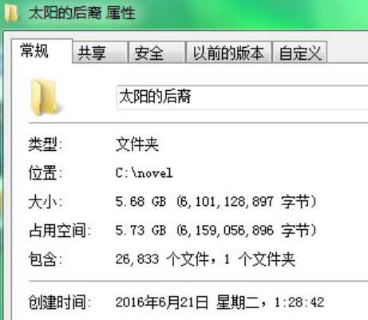
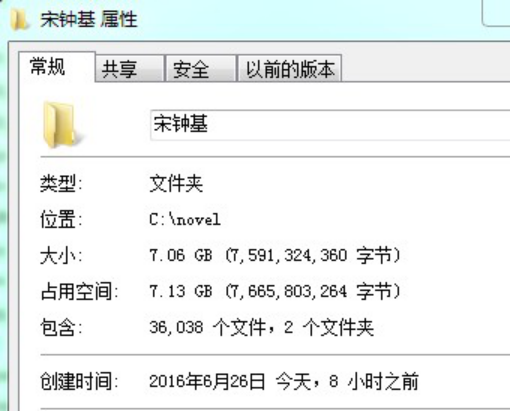
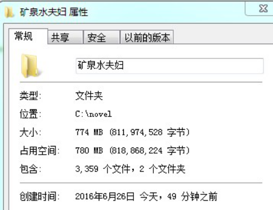
软件参数说明:
+ 百度贴吧名: 一定要真实存在的,能正常访问的吧名! 可以输入单个吧名,也可以输入多个用逗号分隔的吧名, 比如太阳的后裔 或者太阳的后裔,宋钟基.这是全吧备份.
+ 指定帖子号: 帖子地址最后/后面的几位数字, 比如你想下载这个帖子就输入1023356409  同样可以用逗号分隔多个帖子号.这个时候需要把百度贴吧名留空白.这是部分备份.(http://tieba.baidu.com/p/1023356409)
+ 页码范围: 输入百度贴吧名时指定只下载第几页翻到第几页; 输入帖子号时指定帖子只下载第几页翻到第几页.
+ 标题过滤: 当帖子标题含有这些关键字时不下载.多个关键字用逗号分隔,,帖子号用#  #包围. 比如盖楼,聊天,水楼,#1023356409# 就是标题中含有盖楼,聊天,水楼的不下载,帖子号是102356409的也不载.用这种方式把无聊的水贴过滤掉.
+ 保存路径: 指定备份文件保存到哪里.默认是本程序同目录下,吧名作为文件夹名.
+ 只看楼主: 针对帖子有3个选项: 1全部 2全不 3当翻页多于X页. 建议对小贴吧全不, 对大水吧全部,对同人文比较多的吧设置 当翻页多于5页只看楼主.
+ 补页: 此项选中时必须填贴吧名(单个)和页码范围.不可填帖子号.用于备份中途中断后继续备份.
+ 网页精简: 把网页中多余的广告,回复,侧边栏等内容删除(目前只是隐藏而已).还没作好.万一哪天做好了会变成正常.目前是灰色的不可用.
+ 开始备份: 全部填好了点这个开始工作

所有这些可以设置默认值在配置文件ini.txt中,格式为
+ name=[]
+ id=[]
+ id1=[]
+ id2=[]
+ filter=[盖楼,聊天,水楼]
+ path=[C:\novel\]
+ proxy=[]
+ see_lz=[7] 
+ (ini.txt)
备份方案举例:
1. 对伯爵与妖精吧全备份,当帖子翻页多于10页的只看楼主
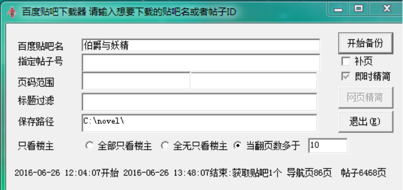
2. 对帖子(http://tieba.baidu.com/p/1023356409) 进行备份,只要前20页,全部
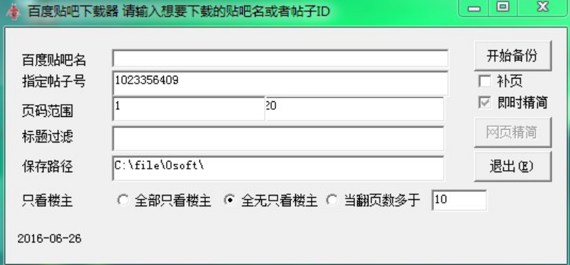
3. 在对太阳的后裔吧备份过程中电脑意外死机.C:\Novel\太阳的后裔\a这个文件夹下面最后一个更新的文件是link_pn15.txt 要继续备份
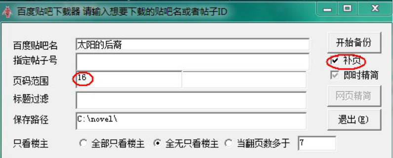
4. 对宋仲基和矿泉水夫妇吧进行备份,标题中含有盖楼,聊天,水楼的不下载,凡是帖子翻页超过6页的,只看楼主.
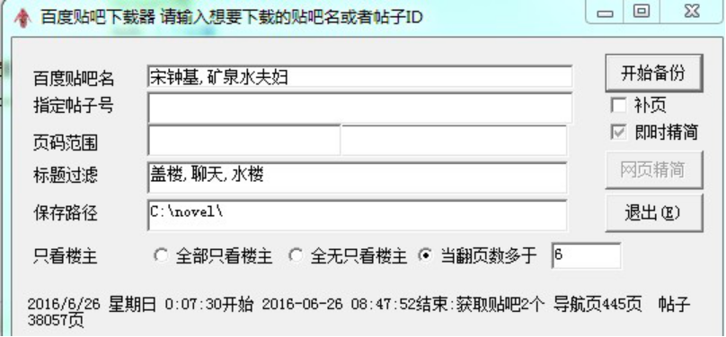

